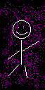

SlugFest '97 DX Help
====================

**Version 1.0 - December 25, 2011**

**Table of Contents**

*   [Welcome to SlugFest '97!](#welcome-to-slugfest-97)
*   Getting Started
    *   [Starting the Game](#starting-the-game)
    *   [Keyboard Controls](#keyboard-controls)
*   Other Stuff
    *   [Tips and Tricks](#tips-and-tricks)
    *   [Character Bios](#character-bios)
*   [SlugFest '97 DX Enhancements](#slugfest-97-dx-enhancements)

* * *

Welcome to SlugFest '97!
========================

**SlugFest '97 was created in 1997 by Greg and Erin Kennedy and Rusty Terwelp**  
*See the credits of the game for more information on who made what.*

If you're reading this, then you're obviously one of the creators of the game, or a close friend of one of the creators. In any case, this is a fighting game in which you may select one of nine different characters to play as. Then your opponent selects another character and you all duke it out! This game features hilarious characters and good animation, as well as a bloody, bone-covered arena and three secret characters. Have fun!

Story So Far
------------

Once upon a time on Planet Earth, there was a large German Mafia residing in Germany. Now the German people, by nature, are prejudiced against people named Bob simply because their (the Germans') name is usually Hans or Fritz. They got to thinking one night over their beers and hit upon an idea: they can trick all the Bobs in the world to come to them and eradicate each other in a faked tournament! This sounded good to all of them (mainly because they were all drunk) and the date for the tournament was set. It worked exactly as planned, except that there were no restrictions on tournament entrants and many other people joined in the fray. All that remains are the last nine survivors of the tournament.

[Back to Top](#slugfest-97-dx-help)

* * *

Starting the Game
=================

Starting the game should be pretty simple - Just run the program slugfest.exe and you'll be in it. The only thing you need is to put an audio CD in the drive, so you'll hear music while playing. (I don't know why, but this just seems to help the performance of the game greatly.) You may want to put in the CD first and then run the game, otherwise you may get problems with the CD starting to AutoPlay while it's already playing, and then things get all screwed up. Next you can see the title, just click on it. Then you see the credits, just click through that too. Then you're in the game. Pick a button for player 1, then one for player 2. Then you're in the arena. The game's not over till somebody is dead so see the Keys section for how to beat the crap out of the other player. Then click Okay when somebody wins and you're back at the character selection screen. You can quit from here.

[Back to Top](#slugfest-97-dx-help)

* * *

Keyboard Controls
=================

Keys are as follows:

|                | Player 1: | Player 2: |
|----------------|-----------|-----------|
| Jump:          | W         | I         |
| Duck:          | S         | K         |
| Move Left:     | A         | J         |
| Move Right:    | D         | L         |
| Punch:         | E         | U         |
| Kick:          | Q         | O         |
| Secret Attack: | C         | M         |

[Back to Top](#slugfest-97-dx-help)

* * *

Tips and Tricks
===============

So you've played and lost some? Maybe these will help.

Some things you might try:

*   Health regenerates. If you're losing, try to stay out of the battle.
*   Don't let the other guy's health regenerate. Smack him down.
*   Hit the keys as fast as possible. Holding down a key doesn't work.
*   Try to duck and jump a lot. Jumping avoids kicks, duck for punches.
*   If they're jumping a lot, punch them. If they duck, kick them.
*   If you're a secret character, they can't avoid your secret attack.
*   Practice makes perfect!
*   Select some music that you think will help you win.

[Back to Top](#slugfest-97-dx-help)

* * *

Character Bios
==============

 The German Mafia- All members of the German Mafia must pass three tests: First, they must be able to fire a handgun. Second, they must be able to use spray paint effectively. Third, they must be able to eat their weight in vienerschnitzel. They are prejudiced against Bobs and began the SlugFest tournament as an effort to lure the Bobs of the world to their doom.

 Bob- Bob is a representative of all the Bobs in the world. He's your average Joe, with a different name. Actually Bob is quite stupid, but that does not stop him and his friend Mr. Black from trying to win.

 The Boxing Clown- The Boxing Clown was on his way to a prize fight, and got lost on the way. Seeing all of the punching, he thought he was at the right place. Plus his name is Bob.

 Harry- Harry was Hippie Girl's trusted sidekick, but he got mad at her because she talked all the time, and the best he could do was to hold up his signs. He entered the tournament to get back at Hippie Girl.

 Hippie Girl- Hippie Girl is a hypocritical hippie who wanted to end all of the violence in the world. She figured the tournament was a good place to start, so she joined in to kill all of the violent people there. As we said, she's a hypocrite, and she is also a little nuts.

 Itchy the Flea- Itchy was a simple flea residing at the farm where the German Mafia started a nuclear fallout. He has mutated to a monster flea, and he is here to get back at the German Mafia for ruining his home. There were originally twelve fighters, but Itchy has eaten three of them so far.

 Mega Mouse- Mega Mouse was also located at the farm with Itchy when a nuclear explosion caused by the German Mafia made him a mutant. Since then he and his best friend Itchy have been working to rid the world of the German Mafia.

 Mr. Black- Mr. Black's real name is Bob and he is a good friend of Bob. Enough said.

 Smiley- No one knows exactly why Smiley joined the contest. The rumors are that he's a pirate named Bob.

De Dot, Dragon, and Pig Boy- These three are the rulers of the universe. They saw the chaos that the German Mafia had created. They had to stop it, and besides, it looked like fun. It is rumored that they are hidden somewhere and will fight in the tournament.

[Back to Top](#slugfest-97-dx-help)

* * *

SlugFest '97 DX Enhancements
============================

SlugFest '97 DX is a complete rewrite of SlugFest '97 in C, using the libSDL library as an underlying layer to provide high performance, compatability, and portability. The port was completed in December 2011, with a release on Christmas Day.

In the process of porting, a number of enhancements and features were added to the game. In particular:

*   Fullscreen Mode
*   Character semi-transparency
*   Backported features from the unfinished SlugFest 2000 project: two new characters, and a new arena
*   MIDI background music (by Greg, Erin and Lauren Kennedy) from 1998, and sound effects from the same time
*   Enhanced strategic fighting engine provides an alternative to the button mashing of the original
*   Additional "options" screen allows keyboard remapping and volume adjustment
*   "Classic" mode to disable all the above features and play the game as originally written

[Back to Top](#slugfest-97-dx-help)

* * *

Please distribute this file with the SDL runtime environment:

The Simple DirectMedia Layer (SDL for short) is a cross-platfrom library designed to make it easy to write multi-media software, such as games and emulators.

The Simple DirectMedia Layer library source code is available from: http://www.libsdl.org/

This library is distributed under the terms of the GNU LGPL license: http://www.gnu.org/copyleft/lesser.html
